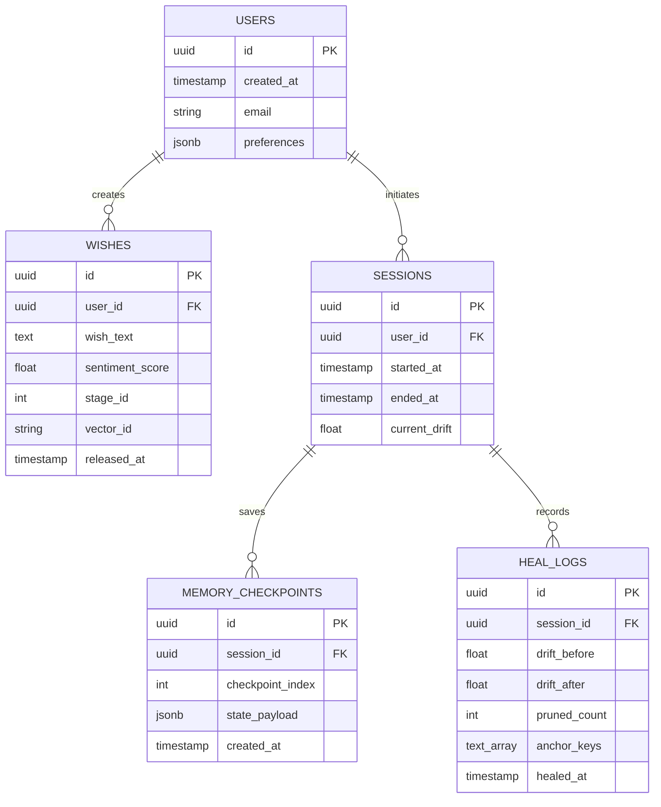

# Database & Persistent Storage Architecture 🗄️

> **Project Wish AI — Multi-Model Storage Infrastructure**  
> *Target Repository: `7soumyajitghosh/wish-website`*  
> *Storage Layers: Relational, In-Memory Cache, Dense Vector, Knowledge Graph*

---

## 1. Storage Architecture Overview

Project Wish AI adopts a polyglot persistence architecture tailored to specific performance and query requirements:
1. **Relational Tier (PostgreSQL):** ACID consistency for user accounts, wish records, transaction ledgers, and audit logs.
2. **In-Memory Cache & Bus (Redis):** Sub-millisecond conversation sliding window buffers, active agent scratchpads, rate limiters, and Pub/Sub sync bus.
3. **Vector Database Tier (Qdrant):** High-dimensional dense vector embeddings for semantic search over long-term memories and user wish similarities.
4. **Graph Database Tier (Neo4j):** Entity-relationship semantic triples connecting stages, emotions, audio harmonics, and visual canvas parameters.

```
┌────────────────────────────────────────────────────────────────────────┐
│                     POLYGLOT STORAGE TOPOLOGY                          │
├──────────────────┬──────────────────┬────────────────┬─────────────────┤
│ 1. PostgreSQL    │ 2. Redis 7.2     │ 3. Qdrant      │ 4. Neo4j 5.x    │
│    (ACID Store)  │ (Cache & Bus)    │ (Vector Store) │ (Knowledge Graph)│
├──────────────────┼──────────────────┼────────────────┼─────────────────┤
│ Users, Wishes,   │ Session Buffers, │ Embeddings     │ Entity Triples, │
│ Audit Trails,    │ Sync Bus, Rate   │ (1536-dim),    │ Emotional Paths,│
│ Checkpoints      │ Limits, Locks    │ Semantic Recall│ Canvas Mappings │
└──────────────────┴──────────────────┴────────────────┴─────────────────┘
```

---

## 2. Relational Schema (PostgreSQL)

### 2.1 Entity Relationship Diagram



### 2.2 SQL DDL Definitions

```sql
-- Core User Table
CREATE TABLE users (
    id UUID PRIMARY KEY DEFAULT gen_random_uuid(),
    created_at TIMESTAMP WITH TIME ZONE DEFAULT NOW() NOT NULL,
    email VARCHAR(255) UNIQUE,
    preferences JSONB DEFAULT '{
        "poetic_tone": "romantic",
        "audio_enabled": false,
        "reduced_motion": false
    }'::jsonb NOT NULL
);

-- Released Wishes Table
CREATE TABLE wishes (
    id UUID PRIMARY KEY DEFAULT gen_random_uuid(),
    user_id UUID REFERENCES users(id) ON DELETE CASCADE,
    wish_text TEXT NOT NULL,
    sentiment_score REAL CHECK (sentiment_score BETWEEN -1.0 AND 1.0),
    stage_id INT NOT NULL DEFAULT 16 CHECK (stage_id BETWEEN 1 AND 16),
    vector_id VARCHAR(64),
    released_at TIMESTAMP WITH TIME ZONE DEFAULT NOW() NOT NULL
);

CREATE INDEX idx_wishes_user ON wishes(user_id);
CREATE INDEX idx_wishes_stage ON wishes(stage_id);

-- MemoryOS Auto-Heal Logs Table
CREATE TABLE memoryos_heal_logs (
    id UUID PRIMARY KEY DEFAULT gen_random_uuid(),
    session_id VARCHAR(128) NOT NULL,
    agent_id VARCHAR(64) NOT NULL,
    drift_before REAL NOT NULL,
    drift_after REAL NOT NULL,
    pruned_count INT NOT NULL,
    anchor_keys TEXT[] NOT NULL,
    healed_at TIMESTAMP WITH TIME ZONE DEFAULT NOW() NOT NULL
);

CREATE INDEX idx_heal_session ON memoryos_heal_logs(session_id);
```

---

## 3. In-Memory Cache & Bus (Redis)

### 3.1 Key Namespace Strategy
- `sess:{sessionId}:buffer` $\implies$ `List<JSON>`: Sliding conversation turns (capped at 10 items).
- `sess:{sessionId}:drift` $\implies$ `Float`: Current agent drift score.
- `agent:{agentId}:state` $\implies$ `Hash`: Active agent working scratchpad, role, and locks.
- `ratelimit:{ipAddress}:{timestampMin}` $\implies$ `Integer`: Request counter expiring in 60s.

### 3.2 Pub/Sub Sync Bus
- **Channel:** `memoryos:sync_bus`
- **Payload:**
  ```json
  {
    "event": "HEAL_COMPLETED",
    "agentId": "poetic-muse-01",
    "sessionId": "sess_4840",
    "newDrift": 0.12,
    "timestamp": 1758400000000
  }
  ```

---

## 4. Dense Vector Database (Qdrant)

### 4.1 Collection Configuration
- **Collection:** `wish_memory_embeddings`
- **Vector Size:** 1536 (OpenAI `text-embedding-3-small`) or 768 (Gemini `text-embedding-004`).
- **Distance Metric:** Cosine Similarity.
- **HNSW Index Parameters:** `m = 16`, `ef_construct = 100`.

### 4.2 Payload Data Structure
```json
{
  "id": "mem_vec_902",
  "vector": [0.012, -0.043, 0.081, "..."],
  "payload": {
    "memory_id": "mem_001",
    "layer": "user",
    "content": "User expresses high appreciation for moonlit evening walks.",
    "importance": 0.85,
    "created_at": 1758390000000,
    "user_id": "usr_9981"
  }
}
```

---

## 5. Knowledge Graph Database (Neo4j)

### 5.1 Graph Schema Model
```
(User)-[:RELEASED]->(Wish)-[:EVOKES]->(Emotion)-[:EXPRESSED_BY]->(Stage)
   │                   │
   ▼                   ▼
(ToneProfile)     (CanvasVisual)-[:PAIRED_WITH]->(AudioFrequency)
```

### 5.2 Sample Cypher Creation & Query
```cypher
// Create Stage 16 Relationship
CREATE (s16:Stage {id: 16, title: "Where Love Takes Flight"})
CREATE (e:Emotion {name: "Transcendent Affection", valence: 0.95})
CREATE (c:CanvasPalette {name: "Twilight Sunset", sunGlow: "#ffd166", skyTint: "#0d0408"})
CREATE (a:AudioFrequency {chord: "Cmaj7/9", rootHz: 130.81})

CREATE (s16)-[:EVOKES]->(e)
CREATE (e)-[:REFLECTED_IN]->(c)
CREATE (c)-[:HARMONIZES_WITH]->(a);

// Retrieve Aesthetics for Emotion
MATCH (e:Emotion {name: "Transcendent Affection"})-[:REFLECTED_IN]->(c:CanvasPalette)-[:HARMONIZES_WITH]->(a:AudioFrequency)
RETURN c.sunGlow, c.skyTint, a.chord, a.rootHz;
```

---

## 6. Retention & Pruning Policies

1. **Short-Term Conversation:** Automatically pruned in Redis when turn count exceeds 10; summarized into episodic memory by the Context Manager.
2. **Auto-Heal Pruning:** Memories with relevance score $\text{relevance}(m, t) < 0.25$ are purged from working context during auto-heal events.
3. **Database Archiving:** Wishes older than 365 days are archived to compressed cold storage (S3 Parquet files).
