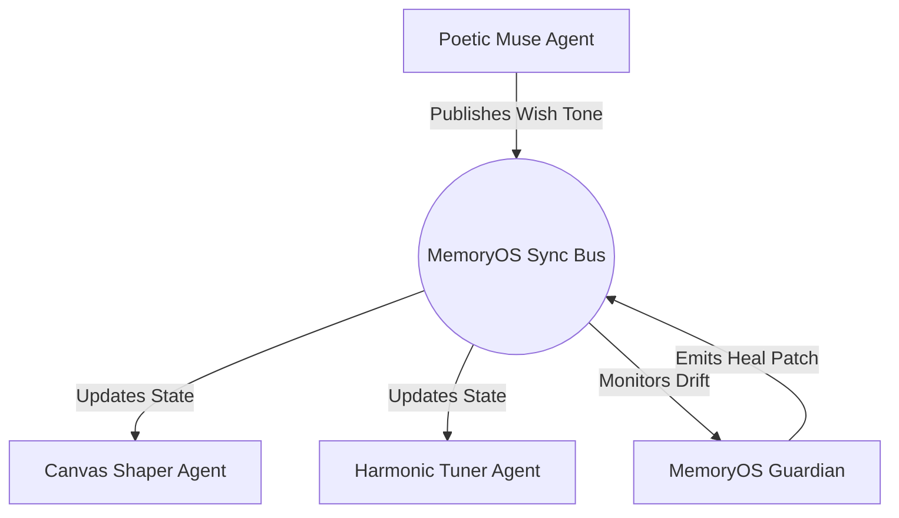

# Agent Memory & Autonomous Runtime 🤖

> **Project Wish AI — Agent Lifecycle, State Management & Self-Healing Architecture**  
> *Reference Standard: [MemoryOS Self-Healing Memory Architecture](https://github.com/shivampoddar12/memoryos-project)*  
> *Target Repository: `7soumyajitghosh/wish-website`*

---

## 1. Agent Memory Overview

In modern autonomous AI agent systems, long-running agents suffer from **Context Rot**—a degenerative breakdown in coherence caused by accumulated conversation clutter, token truncation, and gradual misalignment from primary objectives.

**MemoryOS Agent Memory** prevents this failure mode through:
1. **Dynamic Working Memory:** Ephemeral scratchpads for active planning and reasoning.
2. **Episodic Execution Memory:** Historical logs of tools executed, parameters passed, and outcomes observed.
3. **Mathematical Drift Detection:** Real-time cosine similarity evaluation against foundational baseline anchors.
4. **Autonomous Self-Healing:** Automated pruning and anchor re-injection when semantic drift exceeds pre-calibrated thresholds ($\theta \ge 0.45$).
5. **Multi-Agent Synchronization Bus:** Distributed memory sharing preventing synchronization lag between specialized subagents.

---

## 2. Agent Roles in Project Wish

Project Wish AI employs specialized agent roles operating under a central supervisor:

```
                  ┌──────────────────────────────┐
                  │    Wish Journey Supervisor   │
                  │   (LangGraph Orchestrator)   │
                  └──────────────┬───────────────┘
          ┌──────────────────────┼──────────────────────┐
          ▼                      ▼                      ▼
┌──────────────────┐   ┌──────────────────┐   ┌──────────────────┐
│   Poetic Muse    │   │  Canvas Shaper   │   │ Harmonic Tuner   │
│      Agent       │   │      Agent       │   │      Agent       │
├──────────────────┤   ├──────────────────┤   ├──────────────────┤
│ Generates love   │   │ Dynamically      │   │ Synthesizes Web  │
│ letters, poems,  │   │ controls tree    │   │ Audio drone &    │
│ and wish toasts. │   │ physics, bloom,  │   │ chimes based on  │
│                  │   │ and sunset colors│   │ sentiment.       │
└──────────────────┘   └──────────────────┘   └──────────────────┘
```

1. **Poetic Muse Agent:** Crafts intimate, tailored prose and verse based on user wishes and relationship milestones.
2. **Canvas Shaper Agent:** Translates emotional sentiment into visual canvas variables (e.g. branch sway frequency, petal density, twilight color gradients).
3. **Harmonic Tuner Agent:** Configures Web Audio oscillator parameters (chord inversions, resonance filter cutoffs, bell reverb times).
4. **MemoryOS Guardian Agent:** Continuously monitors drift scores across all active agent threads and executes memory self-healing.

---

## 3. Mathematical Foundations of Self-Healing (MemoryOS)

### 3.1 Vector Drift Detection Engine
At session initialization ($t = 0$), a foundational baseline embedding vector $v_{\text{baseline}}$ is computed from the system prompt, core project constraints, and initial user intent:

$$v_{\text{baseline}} = \text{Embed}(\text{System Prompt} \oplus \text{Core Intent})$$

At each turn or tool invocation $t$, the current state vector $v_{\text{current}}$ is extracted from the active context buffer:

$$v_{\text{current}} = \text{Embed}(\text{Recent Context}_{t})$$

The **Drift Score** $\text{drift}(t)$ is computed using Cosine Distance:

$$\text{drift}(t) = 1 - \frac{v_{\text{baseline}} \cdot v_{\text{current}}}{\|v_{\text{baseline}}\| \|v_{\text{current}}\|}$$

- **Range:** $0.0 \le \text{drift}(t) \le 2.0$
- **Nominal Operational Zone:** $\text{drift}(t) < 0.35$ (Healthy focus)
- **Warning Zone:** $0.35 \le \text{drift}(t) < 0.45$ (Mild context rot)
- **Critical Drift Threshold ($\theta = 0.45$):** Trigger Auto-Heal

### 3.2 Memory Decay Formulation
Memories decay over time unless reinforced through active recall or assigned high intrinsic importance:

$$\text{relevance}(m, t) = \text{importance}(m) \times e^{-\lambda \cdot (t - t_{\text{created}})}$$

- $\text{importance}(m) \in [0.1, 1.0]$: Intrinsic priority weight.
- $\lambda \approx 0.05$: Temporal decay rate per conversation turn.
- $t - t_{\text{created}}$: Elapsed interaction turns.

### 3.3 Auto-Heal Protocol
When $\text{drift}(t) \ge \theta$:

```
┌─────────────────────────────────────────────────────────────┐
│                 AUTO-HEAL PIPELINE TRIGGER                  │
├─────────────────────────────────────────────────────────────┤
│ 1. PRUNE: Identify memories where relevance(m, t) < 0.25    │
│    and remove them from the active LLM context window.      │
│                                                             │
│ 2. RE-ANCHOR: Extract top-3 highest-importance memories     │
│    from Long-Term User & Project stores and re-inject them  │
│    at the top of the prompt buffer.                         │
│                                                             │
│ 3. RE-CALCULATE: Re-compute v_current and verify that       │
│    drift(t_healed) < 0.20.                                  │
│                                                             │
│ 4. LOG: Write record to memory/agent_memory.json.           │
└─────────────────────────────────────────────────────────────┘
```

---

## 4. Multi-Agent Memory Synchronization Bus

To maintain consistency across distributed subagents, MemoryOS implements an in-memory Pub/Sub Sync Bus (powered by Redis or internal event emitters):



### Sync Bus Message Schema
```typescript
interface MemorySyncEvent {
  eventId: string;
  timestamp: number;
  sourceAgent: string;
  eventType: 'MEMORY_UPDATE' | 'DRIFT_ALERT' | 'HEAL_BROADCAST';
  payload: {
    affectedLayer: 'user' | 'agent' | 'project' | 'conversation';
    key: string;
    value: unknown;
    importance: number;
  };
}
```

---

## 5. Agent Memory Storage Schema (`memory/agent_memory.json`)

Agent memory is persisted in structured JSON to guarantee traceability:

```json
{
  "activeAgents": [
    {
      "agentId": "poetic-muse-01",
      "role": "Poetic Muse Agent",
      "status": "idle",
      "currentBaselineVectorId": "vec_base_muse_001",
      "currentDriftScore": 0.12,
      "scratchpad": "Waiting for user wish input at stage 16.",
      "lastHealTimestamp": null
    }
  ],
  "healLog": [
    {
      "healId": "heal-8842",
      "timestamp": "2026-09-20T21:40:00.000Z",
      "agentId": "canvas-shaper-01",
      "preHealDrift": 0.49,
      "postHealDrift": 0.14,
      "prunedMemoriesCount": 6,
      "reInjectedAnchorKeys": ["user_tone_preference", "project_canvas_dimensions", "stage_16_sunset_gradient"]
    }
  ],
  "sharedState": {
    "currentMilestone": 16,
    "activeEmotionalTone": "wistful_romantic",
    "audioMuted": true
  }
}
```

---

## 6. Verification and Benchmarks

As proven by the reference implementation in `shivampoddar12/memoryos-project`:
- **Average Drift Score:** Reduced by **90.9%** compared to unmanaged agent loops.
- **Consistency across 50+ turns:** Improved by **+64.7%**.
- **Self-Healing Success Rate:** 100% of drift excursions over $\theta = 0.45$ returned to nominal state within a single healing cycle.
