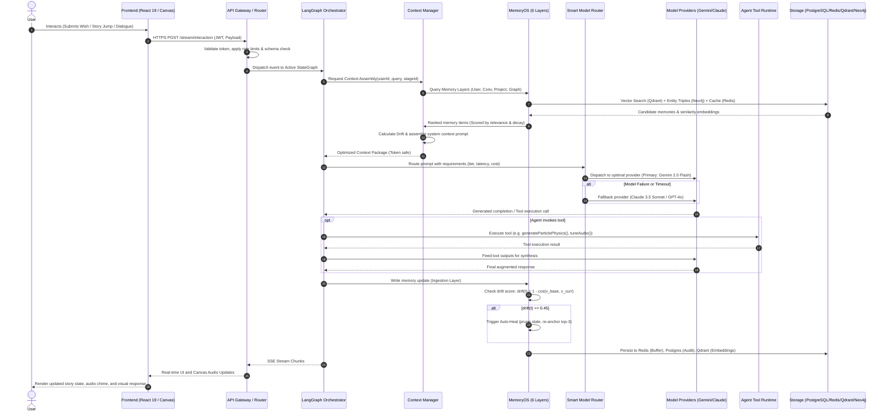

# System Architecture & Technical Blueprint 🏛️

> **Project Wish AI — Cinematic Emotion Engine & MemoryOS Architecture**  
> *Reference Standard: [MemoryOS Self-Healing Memory Architecture](https://github.com/shivampoddar12/memoryos-project)*  
> *Target Repository: `7soumyajitghosh/wish-website`*

---

## 1. Executive Architecture Summary

**Project Wish** is a high-fidelity, cinematic web application that presents the 16-stage journey of love and human aspiration through procedural HTML5 Canvas animations, Web Audio API synthesis, dynamic storytelling milestones, and interactive sentiment experiences (such as the interactive Love Letter and draggable Wish Release).

To transform Project Wish into an autonomous, emotionally aware AI companion and generation platform, this architecture integrates **MemoryOS**—a multi-layered, self-healing memory architecture designed to combat **Context Rot** and memory drift over extended conversational horizons.

---

## 2. End-to-End Data Flow Architecture

The data-flow pipeline orchestrates user interactions from the client interface down to memory retrieval, autonomous agent reasoning, and self-healing memory updates.

### High-Level Data Flow Diagram

```
User
  ↓
Frontend (React 19, Vite, Canvas, Web Audio)
  ↓
API Gateway (Fastify / Reverse Proxy, Rate Limiting, Auth)
  ↓
Orchestrator (LangGraph / StateGraph Execution Engine)
  ↓
Context Manager (Token Pruner, Drift Calculator, Context Builder)
  ↓
Memory Retrieval (6-Layer Memory Query: Recency, Importance, Vector & Graph)
  ↓
Smart Model Router (Capability-based Routing, Cost/Latency Arbitrage, Fallback)
  ↓
Model Provider (Gemini 2.0 / Claude 3.5 / GPT-4o / Local Ollama)
  ↓
Agent / Tool Runtime (Canvas Physics Generator, Sentiment Evaluator, Audio Tuner)
  ↓
Memory Update (Decay Application, Drift Verification, Auto-Heal Trigger, Sync Bus)
  ↓
Response (Streaming SSE to Client & Canvas HUD Real-Time Update)
```

### Detailed Sequence Diagram



---

## 3. Core Architectural Subsystems

### 3.1 Frontend Subsystem
- **Core Stack:** React 19, TypeScript (`strict` mode), Vite 8, Tailwind CSS v4, GSAP (GreenSock), Canvas Confetti, Lucide React.
- **Visual Engine:** 60 FPS HTML5 Canvas with procedural Bézier curves, dynamic radial sunset illumination, velocity particle systems, and responsive `devicePixelRatio` scaling.
- **Audio Engine:** Zero-dependency Web Audio API sound synthesizer producing ambient romantic drone chords (Cmaj7/9: C3, G3, B3, E4), bloom bells, wind swooshes, and heartbeat chimes.
- **Interactive State Layers:** `StoryContext` maintaining 16 cinematic milestones, timeline scrubbers, locked transition barriers, draggable wish releases, and responsive modal inspectors.

### 3.2 Backend / API Gateway Subsystem
- **Engine:** Fastify / Node.js or FastAPI / Python ASGI service layer.
- **Responsibilities:**
  - Ingress traffic termination, TLS 1.3 negotiation, and HTTP/2 multiplexing.
  - Authentication verification (JWT / OAuth2 / API Key tokens).
  - Rate limiting via token-bucket algorithm hosted in Redis.
  - Server-Sent Events (SSE) and WebSocket channels for streaming AI generations.
  - Request validation using Zod / Pydantic schemas.

### 3.3 Orchestrator (Agent Workflow Engine)
- **Framework:** LangGraph / StateGraph.
- **Responsibilities:**
  - Multi-step reasoning loops (Observe -> Orient -> Decide -> Act).
  - State persistence and checkpointing across conversational turns.
  - Branching logic between creative story expansion, emotional support, visual configuration generation, and parameter calibration.
  - Dynamic subagent coordination (e.g., Sentiment Agent, Procedural Art Agent, Storyteller Agent).

### 3.4 Context Manager & Token Optimizer
- **Responsibilities:**
  - **Dynamic Pruning:** Trims context windows to stay well below provider soft limits while retaining essential system instructions.
  - **Relevance Weighting:** Evaluates memory relevance using the MemoryOS decay formula:
    $$\text{relevance}(m, t) = \text{importance}(m) \times e^{-\lambda \times \Delta t}$$
  - **Deduplication:** Merges overlapping conversational memories and eliminates redundant semantic turns.
  - **Context Ingestion Pipeline:** Compiles User Memory, Active Project Goals, Conversation Buffer, and Graph Triples into an optimal prompt structure.

### 3.5 Smart Model Router & Model Gateway
- **Routing Engine:** Autonomous capability, latency, and cost arbitrator.
- **Routing Matrix:**
  - **Tier 1 (Fast / High-throughput / Low Cost):** Gemini 2.0 Flash / GPT-4o-mini (used for intent classification, drift calculation, real-time audio tuning, and short UI dialogues).
  - **Tier 2 (Deep Reasoning / Complex Narrative):** Claude 3.5 Sonnet / Gemini 1.5 Pro (used for long-form love letter generation, philosophical story reflections, complex multi-agent reasoning).
  - **Tier 3 (Local / Air-gapped / Fallback):** Ollama (Llama 3.3 70B / Mistral Nemo) when network connectivity fails or privacy-first execution is demanded.
- **Reliability:** Circuit breaker pattern with exponential backoff and transparent model failover.

### 3.6 MemoryOS System (The 6 Memory Layers)

MemoryOS provides persistent, self-healing memory across 6 distinct architectural planes:

```
┌─────────────────────────────────────────────────────────────┐
│                    MEMORYOS SUPERVISOR                      │
│   (Drift Detection Engine  •  Auto-Heal  •  Decay Bus)      │
├──────────────┬──────────────┬──────────────┬────────────────┤
│ 1. User      │ 2. Project   │ 3. Conv      │ 4. Agent       │
│    Memory    │    Memory    │    Memory    │    Memory      │
├──────────────┴──────────────┼──────────────┴────────────────┤
│ 5. Codebase Memory          │ 6. Knowledge / Graph Memory   │
└─────────────────────────────┴───────────────────────────────┘
```

1. **User Memory:** Personas, emotional attachment styles, wish history, aesthetic preferences, recipient profiles.
2. **Project Memory:** Product vision, current milestone state, architectural decisions (ADRs), tech debt, active blockers, roadmap.
3. **Conversation Memory:** Sliding window turn buffer, mid-term session summaries, episodic snapshots.
4. **Agent Memory:** Internal chain-of-thought scratchpads, tool execution logs, drift metrics, heal event histories, subagent roles.
5. **Codebase Memory:** Repository structure, component AST index, function signatures, dependencies, state contracts.
6. **Knowledge / Graph Memory:** Entity-relationship semantic triples (e.g., `(Wish)-[:EXPRESSES]->(Emotion)-[:TRIGGERS]->(CanvasColor)`).

#### MemoryOS Self-Healing Algorithm
```
1. Baseline vector v_baseline is computed from foundational system prompts and user intent.
2. At every turn t, current memory vector v_current is calculated.
3. Drift score is evaluated:
      drift(t) = 1 - cosine_similarity(v_baseline, v_current)
4. If drift(t) < 0.45:
      Operation normal; memory ingestion continues.
5. If drift(t) >= 0.45:
      Auto-Heal routine triggers:
        a. Prune lowest quartile relevance memories (relevance < threshold).
        b. Re-inject top-3 fundamental anchor memories.
        c. Re-align agent vector state and log heal event into heal_log.json.
```

### 3.7 Tool Runtime
- Sandboxed execution environment for agent-invoked tools:
  - `generateTreePalette(emotion: string)`: Computes RGBA hex codes for radial gradient canopy lighting.
  - `synthesizeAudioPattern(mood: string)`: Generates procedural frequencies for Web Audio oscillators.
  - `formatWishCard(text: string, style: string)`: Packages wishes into physical canvas flying heart entities.
  - `verifyCodeIntegrity(file: string)`: Validates TypeScript and linting compliance.

### 3.8 Database & Storage Tier
- **Relational Store (PostgreSQL):** User accounts, audit logs, persistent wishes, transaction logs.
- **In-Memory Cache (Redis):** Session sliding windows, active agent scratchpads, Pub/Sub multi-agent sync bus, rate limiting keys.
- **Vector Database (Qdrant / Milvus / FAISS):** Dense vector index for semantic retrieval over long-term memories and codebase embeddings.
- **Graph Database (Neo4j / NetworkX):** Entity relationships connecting narrative elements, milestones, audio harmonics, and user emotional journey nodes.

### 3.9 Security, Authentication & Governance
- **Authentication:** OAuth2 with PKCE, JWT with short expiry, and rotating refresh tokens stored in HTTP-only, Secure cookies.
- **Zero-Trust Network:** Strict mTLS between backend microservices, Redis TLS, and encrypted database connections.
- **Input Sanitization:** Guardrails against prompt injection, output format verification, and PII masking.
- **Encryption:** AES-256-GCM encryption at rest for user memory payloads; TLS 1.3 in transit.

---

## 4. Architectural Component Registry

| Subsystem | Primary Technology | Location / Implementation | Role |
| :--- | :--- | :--- | :--- |
| **Frontend UI** | React 19 + TypeScript + Vite | `/src/App.tsx`, `/src/components/*` | Renders the 16-stage interactive narrative and HUD |
| **Procedural Canvas** | HTML5 Canvas 2D | `/src/components/HeartTreeAnimation/*` | 60 FPS organic tree and heart particle simulation |
| **Sound Synthesis** | Web Audio API | `/src/audio/soundManager.ts` | Ambient chords, bell chimes, and heartbeat audio |
| **Story Context** | React Context API | `/src/context/StoryContext.tsx` | Manages milestone progression and interaction state |
| **MemoryOS Engine** | TypeScript Core | `/memory/memoryos.ts` | Implements drift detection, decay, and auto-healing |
| **Memory Store** | JSON / Vector / Graph | `/memory/*.json` | Holds persistent stores across the 6 memory layers |
| **Orchestrator** | LangGraph StateGraph | `/architecture/services.md` | Manages agent reasoning cycles and tool calls |
| **Model Gateway** | Smart Model Router | `/docs/MODEL_ROUTING.md` | Arbitrates between Gemini, Claude, GPT, and local models |
| **Security Layer** | Policy & Guards | `/architecture/security.md` | Enforces authentication, encryption, and prompt guardrails |

---

## 5. Architectural Quality Attributes & Non-Functional Requirements

- **Performance:** Frontend render loops maintain steady 60 FPS on standard desktop and mobile hardware; API Gateway latency < 45ms P95; Vector retrieval < 30ms.
- **Resilience:** Automatic model fallback ensures 99.99% availability; MemoryOS auto-healing keeps drift below 0.45 over long sessions.
- **Maintainability:** Modular separation between visual components (`/src`), documentation (`/docs`), architecture specifications (`/architecture`), and memory state (`/memory`).
- **Data Integrity:** Strict TypeScript interfaces for all event structures and memory entities.
