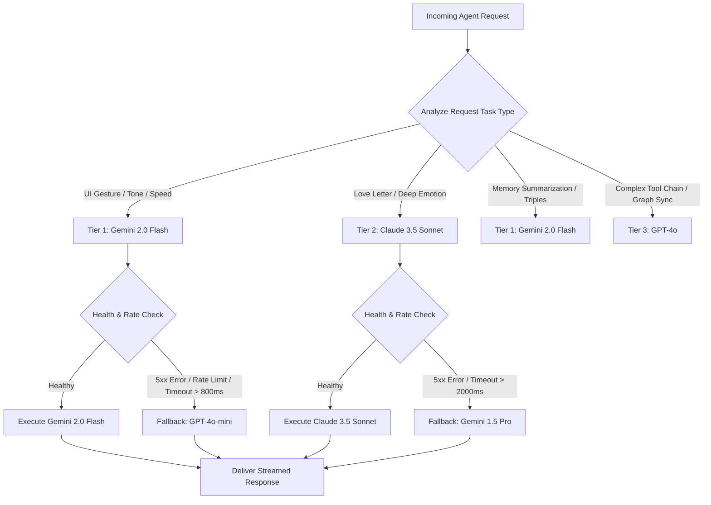

# Smart Model Routing & Model Gateway 🧭

> **Project Wish AI — Multi-Provider Gateway & Intelligent Fallback Architecture**  
> *Target Repository: `7soumyajitghosh/wish-website`*  
> *Routing Standard: Capability, Cost, and Latency Arbitrage*

---

## 1. Overview & Objectives

In Project Wish AI, different tasks demand vastly different model capabilities:
- Real-time gesture sentiment and canvas parameter adjustments require **ultra-low latency (< 400ms)** and high token throughput.
- Expressive romantic poetry and personalized love letters demand **deep semantic nuance, emotional resonance, and zero robotic cliché**.
- Background memory summarization, embedding generation, and drift detection require **cost-effective bulk processing**.
- Offline or air-gapped deployments require **local model execution**.

The **Smart Model Router (SMR)** acts as a dynamic reverse proxy and decision engine positioned between the LangGraph Orchestrator and external model providers.

---

## 2. Multi-Provider Tier Matrix

| Tier | Primary Model | Provider | Strengths | Ideal Use Cases | Fallback Model |
| :--- | :--- | :--- | :--- | :--- | :--- |
| **Tier 1: Real-Time & Interactive** | **Gemini 2.0 Flash** | Google Vertex / AI Studio | Sub-350ms TTFT (Time to First Token), high throughput, low cost | Real-time wish feedback, canvas visual styling, audio parameter tuning, intent classification | GPT-4o-mini |
| **Tier 2: High Emotional Resonance** | **Claude 3.5 Sonnet** | Anthropic API | Unrivaled lyricism, emotional empathy, complex stylistic formatting | Interactive Love Letter generation, long-form poetic reflections, philosophical milestone commentary | Gemini 1.5 Pro |
| **Tier 3: Complex Multi-Step Reasoning** | **GPT-4o / Claude 3.5 Sonnet** | OpenAI / Anthropic | High tool-calling precision, structured JSON adherence | Multi-agent coordination, Knowledge Graph entity extraction, complex canvas shader logic | Gemini 1.5 Pro |
| **Tier 4: Local & Privacy-Preserving** | **Llama 3.3 (70B) / Mistral Nemo (12B)** | Ollama / vLLM | Zero cloud data transmission, offline capable | Local dev testing, privacy-sensitive wish processing, fallback during internet outages | Mistral 7B |

---

## 3. Dynamic Routing Decision Logic

The router classifies incoming prompts using a lightweight deterministic classifier and heuristics:



---

## 4. Routing Algorithms & Mathematical Criteria

For tasks that have dual constraints (e.g. creative yet budget-limited), the router computes a **Provider Utility Score**:

$$U(p) = w_c \cdot \frac{C_{\max} - C_p}{C_{\max}} + w_l \cdot \frac{L_{\max} - L_p}{L_{\max}} + w_q \cdot Q_p$$

Where:
- $C_p$: Estimated cost for prompt + output tokens (USD).
- $L_p$: Rolling average P95 latency (milliseconds).
- $Q_p \in [0, 1]$: Benchmark emotional quality index for model $p$.
- $w_c, w_l, w_q$: Task-specific weighting factors (where $w_c + w_l + w_q = 1$).

### Example Weight Configurations
- **Real-Time Wish Particle Launch:** $w_l = 0.7$, $w_c = 0.2$, $w_q = 0.1$ $\implies$ Selects **Gemini 2.0 Flash**.
- **Deluxe Unfolded Love Letter:** $w_q = 0.8$, $w_l = 0.1$, $w_c = 0.1$ $\implies$ Selects **Claude 3.5 Sonnet**.

---

## 5. Circuit Breaker & Fallback Specification

The router maintains an active state machine for every registered provider:

```
┌──────────────┐   Failure Rate >= 5% or 3 Consecutive Timeouts   ┌──────────────┐
│  CLOSED      │ ───────────────────────────────────────────────> │  OPEN        │
│  (Healthy)   │ <─────────────────────────────────────────────── │  (Tripped)   │
└──────────────┘           Successful Health Probe (After 30s)     └──────┬───────┘
                                                                          │
                                                                          │ After 30s
                                                                          ▼
                                                                  ┌──────────────┐
                                                                  │  HALF-OPEN   │
                                                                  │  (Probing)   │
                                                                  └──────────────┘
```

1. **Closed (Healthy):** All traffic routed according to primary Utility Scores.
2. **Open (Tripped):** 3 consecutive HTTP 429/500/503 errors or timeouts cause the router to automatically divert 100% of traffic to the designated fallback tier.
3. **Half-Open (Probing):** After a 30-second cooldown, a single synthetic health ping is dispatched. If successful, normal routing resumes.

---

## 6. Token Accounting & Budget Management

To ensure maximum performance and cost predictability, the Model Gateway enforces strict token bounds:

| Interaction Type | Max Input Tokens | Max Output Tokens | Streaming Mode |
| :--- | :--- | :--- | :--- |
| **Draggable Wish Toast** | 400 | 120 | SSE Chunks |
| **Interactive Love Letter** | 1,200 | 600 | SSE Chunks |
| **Stage 1-16 Milestone Narration** | 800 | 250 | SSE Chunks |
| **MemoryOS Graph Ingestion** | 2,500 | 400 | Non-streaming (Sync) |
| **Drift Recalibration Probe** | 1,000 | 150 | Non-streaming (Sync) |

---

## 7. Model Gateway Configuration Sample (TypeScript)

```typescript
export interface ModelRoutingConfig {
  task: 'wish_sentiment' | 'love_letter' | 'canvas_physics' | 'memory_summary';
  userPreference?: 'speed' | 'poetic_quality' | 'cost_saving';
  timeoutMs: number;
}

export const ROUTING_TABLE: Record<string, { primary: string; fallback: string; maxTokens: number }> = {
  wish_sentiment: {
    primary: 'gemini-2.0-flash',
    fallback: 'gpt-4o-mini',
    maxTokens: 150,
  },
  love_letter: {
    primary: 'claude-3-5-sonnet',
    fallback: 'gemini-1.5-pro',
    maxTokens: 750,
  },
  canvas_physics: {
    primary: 'gemini-2.0-flash',
    fallback: 'gpt-4o-mini',
    maxTokens: 300,
  },
  memory_summary: {
    primary: 'gemini-2.0-flash',
    fallback: 'ollama-llama3.3-70b',
    maxTokens: 500,
  },
};
```
